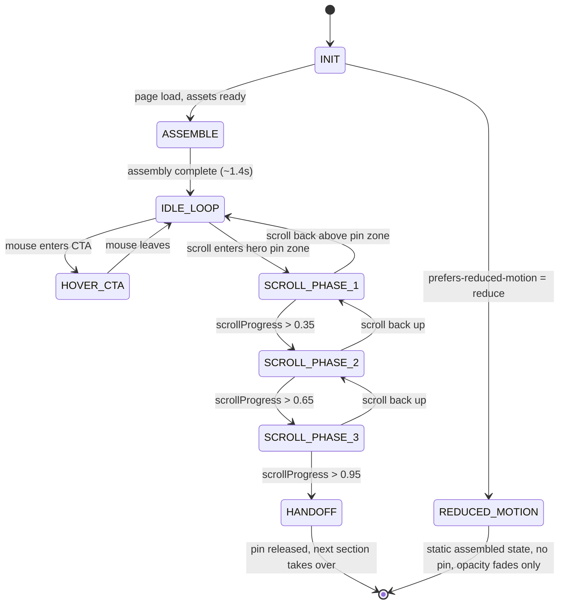

# SUTRA — Six Sense Mobility Hero System
### Industrial-Grade Design & Animation Specification
**Codename:** SUTRA (सूत्र — "thread"; the thing that connects every node in a mesh)
**Subject:** Six Sense Mobility's flagship hardware — the AIS-140 Certified TCU (Telematics Control Unit) with Private Mesh & Edge Intelligence
**Target:** Marketing site hero section, dark-mode-first, light-mode supported
**Status:** v1.0 — ready for implementation

---

## 0. Objective & Scope

Build a hero section that does one thing a template can't: **make the invisible visible**. A TCU's entire value proposition — mesh connectivity, edge intelligence, live telemetry — is *data you can't see*. The hero's job is to render that invisible signal as a literal, animated, physical thing: a device assembling itself, then breathing with live data pulses traveling along its own mesh.

**In scope:** Header system, hero background system, isometric TCU assembly + animation, scroll choreography for the first ~200vh of the page, idle/loop motion system, copy.
**Out of scope:** Full site nav structure, footer, pricing/contact pages, CMS wiring.

**Non-goal:** This is explicitly *not* a gradient-blob SaaS hero, not a Lottie-mascot hero, not a stock-photo-of-a-truck hero. If at any point the build starts to resemble those, stop and re-read Section 14.

---

## 1. Creative Thesis (the one signature element)

> **The device assembles itself from its own mesh, and never stops breathing.**

On load, the TCU's components fly in from off-axis and snap together (exploded-view assembly). Once assembled, thin circuit-trace lines draw themselves outward to the surrounding feature cards, and small **signal pulses** continuously travel along those lines — a literal visualization of "private mesh, edge intelligence, real-time data" that is grounded in what the product *actually does*, not decoration borrowed from an unrelated template.

Everything else in this spec (color, type, motion, scroll) is built to keep that one idea the loudest thing on the page.

---

## 2. Visual Identity System

### 2.1 Color tokens

Monochrome-first, one signal accent — matched to the reference screenshot's grayscale isometric language, not a generic "dark mode + neon" default.

| Token | Dark mode | Light mode | Use |
|---|---|---|---|
| `--void` | `#0A0A0B` | `#F5F4F0` | Primary background |
| `--surface` | `#131316` | `#EBEAE5` | Elevated cards, header pill |
| `--ink` | `#ECEBE7` | `#101012` | Primary text |
| `--graphite` | `#8B8B90` | `#6B6B70` | Secondary text, strokes, wireframe cards |
| `--hairline` | `rgba(255,255,255,.08)` | `rgba(10,10,11,.08)` | Borders, dividers |
| `--signal` | `#E8A33D` | `#C6811F` | The ONE accent — pulses, active states, CTA |
| `--signal-glow` | `#FFD59A` | `#FFD59A` | Bloom/shadow around signal elements only |

**Why amber, not the expected neon-green/acid accent:** phosphor-amber reads as *instrumentation* — radar, oscilloscope, CRT diagnostic displays — which is literally what a TCU is. It's also not the "near-black + acid-green" combination that every AI-generated dark hero defaults to. Verify this against SSM's actual brand kit before shipping; if their real brand accent differs, swap only the `--signal` value — the whole system is built to survive that swap untouched.

Do not introduce a second accent color. The discipline of one signal color is what makes the pulse animation read as meaningful instead of decorative.

### 2.2 Typography

| Role | Face | Notes |
|---|---|---|
| Display (headline) | **Bricolage Grotesque**, weight 600–700 | Used only for the H1 and section titles. Distinctive geometric-humanist character — not Inter, not Satoshi. |
| Body | **Inter**, weight 400–500 | Quiet, restrained, does not compete with display |
| Data / mono | **JetBrains Mono**, weight 400 | Coordinates, device counts, timestamps, the live ticker — reinforces "this is real telemetry, not lorem ipsum" |

Type scale (dark mode base 16px):
- H1: `clamp(2.75rem, 5vw + 1rem, 5.5rem)`, line-height 0.98, tracking -0.02em
- Eyebrow: 0.8125rem, mono, uppercase, tracking 0.16em, `--graphite`
- Body: 1.125rem, line-height 1.6, `--graphite`
- Data readouts: 0.875rem mono, `--signal`

### 2.3 Spacing & grid

12-col grid, max-width 1440px, gutter 24px. Hero content column: 5/12 (text) + 7/12 (isometric assembly) on desktop; stacks to single column under 768px with assembly moved above text.

---

## 3. Layout Architecture

```
┌──────────────────────────────────────────────────────────┐
│  ◇ SIX SENSE          Technology  Fleet  Resources   [Request Demo]  ← floating pill nav
├──────────────────────────────────────────────────────────┤
│                                                            │
│   AIS-140 CERTIFIED · EDGE INTELLIGENCE        ╱╲          │
│                                                ╱  ╲ ← antenna ring (rotating)
│   Telematics that                            ┌──┐          │
│   thinks at the edge.                        │▓▓│ ← TCU hub (black module)
│                                               └──┘          │
│   A single AIS-140 certified TCU with        ╱│╲           │
│   private mesh connectivity, on-device       …pulses travel
│   intelligence, and FOTA-ready firmware.      along mesh lines
│                                              ┌────┐┌────┐   │
│   [Request a demo]  [See the spec sheet]     │map │ │list│  ← flat dashboard
│                                              └────┘└────┘   │  cards, cascading
│   ● LIVE MESH · 24,900+ DEVICES · IN·EU              ┌────┐│
│                                                       │chart│
│                                                       └────┘│
└──────────────────────────────────────────────────────────┘
     ↓ scroll pins here for ~180vh — see Section 7
```

---

## 4. Component Graph

```mermaid
graph TD
    A[HeroSection] --> B[HeroBackground]
    A --> C[HeroHeader]
    A --> D[HeroContent]
    A --> E[HeroIsometricAssembly]
    A --> F[HeroDashboardCards]
    A --> G[useScrollChoreography hook]

    B --> B1[DotGrid layer - diagonal drift]
    B --> B2[Ambient glow blob - breathing]
    B --> B3[Noise/grain overlay - static]

    C --> C1[Logo mark]
    C --> C2[Nav links - fade to icons on scroll]
    C --> C3[CTA pill]
    C --> C4[Condense state - blur + shrink on scroll]

    D --> D1[Eyebrow label]
    D --> D2[H1 - word-stagger reveal]
    D --> D3[Subhead]
    D --> D4[CTA row]
    D --> D5[Live deployment ticker - mono, count-up loop]

    E --> E1[TCU hub module - core]
    E --> E2[Antenna/signal ring - rotate + pulse]
    E --> E3[Server/cloud stack cube]
    E --> E4[Mesh connector lines - SVG paths]
    E --> E5[Signal pulse dots - travel along paths]

    F --> F1[Card: GPS/Location]
    F --> F2[Card: Fleet list]
    F --> F3[Card: Health graph - self-redrawing line]

    G --> G1[GSAP ScrollTrigger timeline]
    G --> G2[Pin container, 180vh scroll distance]
    G --> G3[prefers-reduced-motion guard]
```



---

## 5. Animation State Graph



---

## 6. Idle Loop System

All loops run continuously during `IDLE_LOOP`. Deliberately out-of-phase durations so nothing reads as a single rigid image — this is what separates a "living" hero from a static SVG with one CSS animation slapped on it.

| Element | Motion | Duration | Easing | Phase offset |
|---|---|---|---|---|
| TCU hub (core) | translateY ±6px | 4.2s | easeInOutSine | 0s |
| Antenna ring | rotate 360° | 40s | linear | 0s |
| Antenna ring | scale 1 → 1.05 → 1 | 2.4s | easeInOut | 0s |
| Server/cloud stack | translateY ±4px | 5.6s | easeInOutSine | 1.3s |
| Mesh pulse dot A | travel along path 1 | 3.0s | linear | 0s |
| Mesh pulse dot B | travel along path 2 | 3.0s | linear | 1.0s |
| Mesh pulse dot C | travel along path 3 | 3.0s | linear | 2.0s |
| Card: GPS/location | translateY ±3px | 4.8s | easeInOutSine | 0.6s |
| Card: Fleet list | translateY ±3px | 5.2s | easeInOutSine | 1.8s |
| Card: Health graph | translateY ±3px | 4.4s | easeInOutSine | 2.4s |
| Health graph line | stroke-dashoffset redraw | 6.0s | easeInOut | loops |
| Background dot-grid | translate diagonal | 60s | linear | — |
| Ambient glow blob | scale 1 → 1.08 → 1, blur 80px | 8.0s | easeInOutSine | — |
| Deployment ticker | count up 24,780 → 25,040, hold, reset | 20s | linear count, then hold 6s | — |

**Cursor-reactive layer (desktop only, opt-in with low intensity):** the whole `HeroIsometricAssembly` group tilts up to 4° on rotateX/rotateY based on pointer position, using `transform-style: preserve-3d`. Clamp hard — this should feel like a subtle parallax, never a gimmick. Disable entirely below 1024px width and under reduced-motion.

---

## 7. Scroll Choreography (the "wow" moment)

Hero container is `position: sticky` and pinned for **180vh** of scroll distance (via GSAP ScrollTrigger, scrubbed 1:1 with scroll position — not time-based). `scrollProgress` below is 0→1 across that pin distance.

| Progress | Header | Text | Isometric assembly | Dashboard cards |
|---|---|---|---|---|
| 0.00–0.15 | Full-size, transparent | Idle loop | Idle loop | Idle loop |
| 0.15–0.35 | Condenses into blurred glass pill, links collapse to icons | Drifts up 40px, fades to 0 | Begins rotating from isometric (30°) toward 3/4 front-facing (10°) | Begin separating from hub, translateZ outward |
| 0.35–0.60 | Pill fully condensed, stays pinned top | Fully hidden | Continues rotation, scales 1 → 1.15, becomes visual centerpiece; mesh lines retract into hub | Peel apart fully, arrange into a horizontal filmstrip beneath the assembly |
| 0.60–0.85 | — | Feature filmstrip labels fade in one at a time under each card (see below) | Settles at 3/4 angle, resumes a slow idle rotate (very slow, 90s/rotation) | Whichever card crosses the horizontal center "focus zone" scales to 1.08 and brightens; others dim to 70% opacity |
| 0.85–1.00 | — | — | Fades to 40% opacity, moves to background | Filmstrip cross-fades into the next real page section |

**Filmstrip labels** (grounded in SSM's actual shipped feature set — not placeholder copy):
`01 Immobilization` · `02 Real-Time GPS` · `03 Health & Diagnostics` · `04 Crash Detection` · `05 Trip Reports`
(Numbering is justified here — this is a real, ordered feature set already used in SSM's own product marketing, not decorative 01/02/03.)

**Implementation note:** drive this with GSAP ScrollTrigger's `scrub: true` + a single pinned timeline, not five separate `useScroll` hooks fighting each other. Framer Motion handles the entrance (`ASSEMBLE`) and idle loops; GSAP owns the pin+scrub sequence. Kill/refresh ScrollTrigger on resize.

---

## 8. Background System

Three stacked layers behind everything, `pointer-events: none`:

1. **Dot-grid plane** — matches the isometric ground-plane grid from the reference screenshot. SVG pattern, 24px spacing, `--hairline` color, 6% opacity, very slow diagonal drift (60s linear loop).
2. **Ambient glow** — single radial gradient blob (`--signal-glow` at 8% opacity, 500px blur) positioned behind the TCU hub only. Breathing scale loop (Section 6). This is the *only* soft/blurred element allowed on the page — everything else stays crisp and vector-sharp, which is what keeps this from reading as a generic gradient-mesh hero.
3. **Grain overlay** — subtle SVG `feTurbulence` noise texture, blend-mode `overlay`, ~3% opacity, static (not animated). Kills the "flat digital" look, adds material quality.

---

## 9. Header System

Not a static navbar — a nav that *performs* the same "condense to essential signal" idea as the hero.

- **State: expanded** (scroll 0) — full-width, transparent background, logo + full text nav + CTA button, all at 100% opacity.
- **State: condensed** (scroll into pin zone, see Section 7) — nav becomes a floating pill (rounded-full, `--surface` at 70% opacity + backdrop-blur 20px), centers itself, text links collapse to icon-only with tooltips, CTA shrinks to icon+label chip.
- **Direction-aware reveal** (below the hero, rest of page): pill hides on scroll-down, reappears on scroll-up — standard pattern, executed with a spring transition (not linear) so it feels alive rather than mechanical.
- **Magnetic hover** on nav items and CTA: element translates up to 6px toward cursor position within its own bounding box on hover, springs back on leave. Small detail, disproportionate "premium" signal.

---

## 10. Micro-interactions

- **Primary CTA button**: on hover, the amber signal color sweeps in from the left as a mask-reveal (not a flat background-color transition), plus the magnetic pull from Section 9.
- **Headline reveal on load**: words (not characters) stagger in with a slight rotateX(-90deg) → 0 flip-up + fade, 60ms stagger, spring easing. Characters-level stagger is overused and reads as an AI-template tell; word-level is more restrained.
- **Filmstrip card focus** (Section 7): scale + brightness shift, no drop-shadow bloom — keep it flat/graphic to match the reference screenshot's flat isometric card style.

---

## 11. Copy

Grounded in SSM's real, shipped feature language — not generic SaaS copy.

- **Eyebrow:** `AIS-140 CERTIFIED · EDGE INTELLIGENCE`
- **Headline (recommended):** "Telematics that thinks at the edge."
  - Alt A: "One device. Every signal your fleet sends."
  - Alt B: "The mesh beneath every mile."
- **Subhead:** "A single AIS-140 certified TCU with private mesh connectivity, on-device intelligence, and FOTA-ready firmware — built to keep fleets visible, secure, and moving."
- **Primary CTA:** `Request a demo`
- **Secondary CTA:** `See the spec sheet`
- **Live ticker (mono, small):** `● LIVE MESH · 24,900+ DEVICES · INDIA · EUROPE`
- **Filmstrip labels:** `01 Immobilization` `02 Real-Time GPS` `03 Health & Diagnostics` `04 Crash Detection` `05 Trip Reports`

---

## 12. Tech Stack & File Architecture

**Stack:** React (Next.js) + Tailwind (tokens from Section 2 wired as CSS variables, not hardcoded hex in components) + Framer Motion (entrance + idle loops) + GSAP + ScrollTrigger (pin/scrub sequence) + hand-drawn SVG for the isometric assembly (crisp at any scale, cheap to path-animate — no Lottie, no raster).

```
/components/hero/
  HeroSection.tsx            — composition root
  HeroBackground.tsx         — grid + glow + grain layers
  HeroHeader.tsx             — condensing nav
  HeroContent.tsx            — eyebrow/H1/subhead/CTA/ticker
  HeroIsometricAssembly.tsx  — SVG device + mesh lines + pulses
  HeroDashboardCards.tsx     — 3 flat cards + filmstrip state
  useScrollChoreography.ts   — GSAP ScrollTrigger hook, returns phase + progress
  tokens.css                 — CSS variables from Section 2, light+dark
```

---

## 13. Performance / Accessibility Contract

- Animate only `transform` and `opacity` — never `top/left/width/height` (layout thrash).
- `prefers-reduced-motion: reduce` → skip `ASSEMBLE` and all loops; render final assembled state static; scroll pin disabled entirely (normal document flow); only allow simple opacity fades.
- ScrollTrigger instance created only when hero enters viewport (IntersectionObserver-gated); killed on unmount and on route change.
- Signal amber (`--signal`) on `--void` passes AA for large text/icons only — never use it for body-size text.
- All interactive elements keyboard-focusable with a visible focus ring using `--signal` at 2px offset.
- Mobile (<768px): no cursor-tilt layer, no pin/scrub sequence — replace Section 7 with a simple scroll-triggered fade/slide-up per section, assembly rendered smaller above the text block.

---

## 14. Anti-Pattern Checklist — do not ship if any of these are true

- [ ] Background is a generic multi-color gradient mesh/blob soup → **violates Section 8** (only one glow blob allowed)
- [ ] Accent color is acid-green or vermilion-on-black → **violates Section 2.1**
- [ ] Headline copy could be pasted onto any other B2B SaaS site unchanged → **violates Section 11**
- [ ] Numbered markers used decoratively where no real sequence exists → **violates Section 7 justification**
- [ ] Character-by-character text stagger animation → **violates Section 10** (word-level only)
- [ ] Any stock photo, 3D render, or Lottie mascot in the hero → **violates Section 1**
- [ ] Nav bar is a plain static flexbox row with no condense behavior → **violates Section 9**
- [ ] Motion runs regardless of `prefers-reduced-motion` → **violates Section 13**

---

## 15. Build Phases

1. **Structure** — static layout, tokens, typography, responsive grid. No motion yet.
2. **Assembly + idle loops** — Framer Motion entrance sequence (Section 6), verify it feels alive at rest before touching scroll.
3. **Scroll choreography** — GSAP ScrollTrigger pin/scrub (Section 7). Build and test in isolation before merging with Phase 2's loops (loops should pause/hand off cleanly when scroll takes over).
4. **Polish pass** — micro-interactions (Section 10), header condense (Section 9), reduced-motion fallback, cross-browser check (Safari's `backdrop-blur` + `preserve-3d` support especially), mobile simplification.

## 16. Definition of Done

- [ ] Matches Section 2 tokens exactly — no ad-hoc hex values in components
- [ ] Assembly + idle loop feels alive within 3 seconds of load, no jank
- [ ] Scroll sequence scrubs smoothly at 60fps on a mid-tier laptop, no scroll-jacking feel below the pin zone
- [ ] Reduced-motion fallback tested and looks intentional, not broken
- [ ] Mobile layout tested at 375px width
- [ ] Every item in Section 14 checked off as "does not apply"
